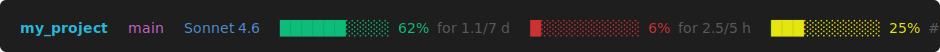

# @eccs0103/claude-cli-status-line

A Claude CLI status line command that renders an ANSI-colored status bar showing your workspace directory, git branch, active model, rate limit usage, and context window consumption.



## Setup

1. Install

	```
	npm install -g @eccs0103/claude-cli-status-line
	```

2. Configure

	Add to your `~/.claude/settings.json`:

	```json
	{
		"statusLine": {
			"type": "command",
			"command": "claude-cli-status-line"
		}
	}
	```

	Or run via the Claude CLI:

	```
	claude config set statusLine.type command
	claude config set statusLine.command "claude-cli-status-line"
	```

## What it shows

| Segment           | Color            | Description                                    |
| ----------------- | ---------------- | ---------------------------------------------- |
| Directory         | Cyan bold        | Last component of the workspace path           |
| Branch            | Magenta          | Current git branch (omitted if not a git repo) |
| Model             | Blue             | Active Claude model display name               |
| 5-hour rate limit | Green/Yellow/Red | Usage bar + percentage + time to reset         |
| 7-day rate limit  | Green/Yellow/Red | Usage bar + percentage + time to reset         |
| Context window    | Green/Yellow/Red | Remaining context as a usage bar + percentage  |

Color thresholds: green (>30% remaining), yellow (10–30%), red (≤10%).
